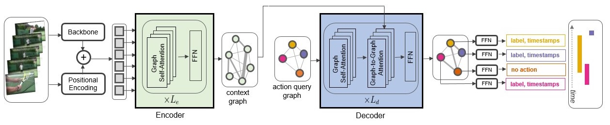

## Activity Graph Transformer for Temporal Action Localization

This repository contains the implementation of Activity Graph Transformers. The paper is available [here](https://arxiv.org/abs/2101.08540) or at the project [website](http://www.sfu.ca/~mnawhal/projects/agt.html).


---

## Model
 
See the following image for an overview of the architecture of Activity Graph Transformer.



---

## Getting Started 

1. Clone the respository.

```
https://github.com/Nmegha2601/activitygraph_transformer.git

```
2. Use [Conda](https://www.anaconda.com/products/individual) to install Python3. Create a new environment in conda, and install dependencies from `requirements.txt`.

```
conda create --name agt_env --file requirements.txt

``` 
3. Extract I3D features. We used [this](https://github.com/piergiaj/pytorch-i3d) to extract the features for each of the dataset in `.npy` format. Place the extracted features in `data/thumos/i3d_feats`

4. Run the code using the following command. This will start training a model on the dataset. The checkpoints and training log will be saved in an automatically created directory `output`. To reproduce the results, use the hyperparameters mentioned in the Appendix section of the paper.

```
bash run_scripts/run_agt.sh

```

---

## Contact

For further questions, please email [Megha Nawhal](http://www.sfu.ca/~mnawhal/).


